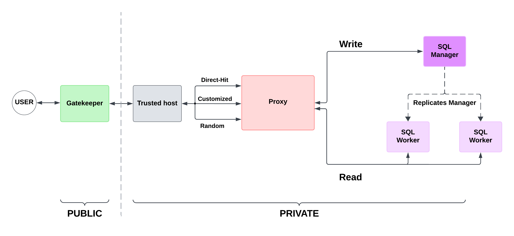

# Advanced Concepts in Cloud Computing - Final Poject

This project demonstrates the implementation of **Cloud Design Patterns** using a MySQL cluster on AWS EC2 instances. The solution integrates the **Proxy Pattern** and **Gatekeeper Pattern** to create a scalable, secure, and efficient database architecture.

The Proxy Pattern is employed to handle read and write operations efficiently across a distributed MySQL cluster. Three distinct implementations are provided: 
1. **Direct Hit**: Requests are directly routed to the manager node without distribution logic.
2. **Random**: Read requests are routed to a randomly selected worker node.
3. **Customized**: Requests are routed based on the response time of worker nodes for optimal performance.

The Gatekeeper Pattern adds an additional security layer by introducing an **internet-facing gatekeeper** and a **trusted host** to validate and route requests securely to the MySQL cluster.

The project also includes benchmarking with **sysbench** to measure the performance of the cluster and automation scripts for end-to-end deployment using AWS SDKs. This ensures the architecture is robust, secure, and easy to replicate.

## System Design:
